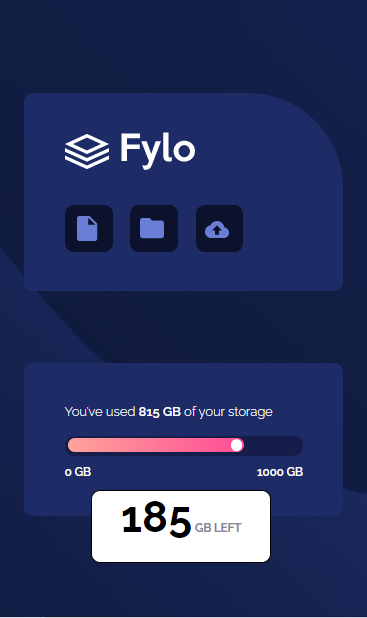
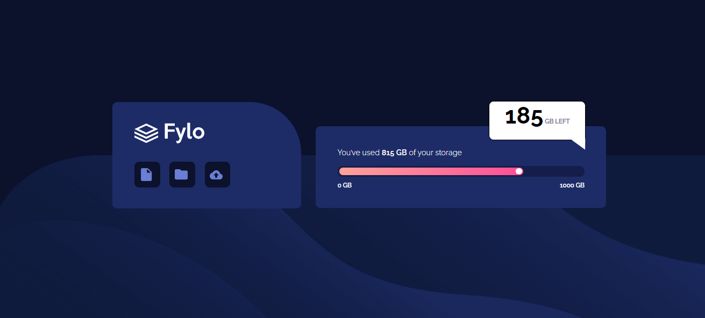

  

<h1 align='center'> Fylo data storage component </h1>

   
   
   

_Para a versão em Português, clique [aqui](#portuguese)._ 

### Topics

- [Project description](#project-description)

- [Technologies used](#technologies-used)

- [What I learned](#what-I-learned)

- [Access the Project](#access-the-project)

 

## Project description

This is fictitious data storage that shows how much has been used and how much space is left. This project is one of the challenges proposed on the [Frontend Mentor](https://www.frontendmentor.io/home) site. The challenge is to recreate the project without the guidance of a design tool (figma) and making it as close as possible to the requested one. 

[The challenge](https://www.frontendmentor.io/challenges/fylo-data-storage-component-1dZPRbV5n)

 

## Technologies used

  
  

 

## What I learned

- Improve my Grid and Flexbox skills;
- To make a more responsive-friendly code.

 

## Access the Project

You can [access the project here](https://caroline-barbosa-vilar.github.io/new-fylo/) 

Mobile:

Tablet:

 

Desktop:

 

<h1 align='center'> Fylo data storage component </h1>

   
   
   

### Tópicos 

- [Descrição do projeto](#descrição-do-projeto)

- [Tecnologias utilizadas](#tecnologias-utilizadas)

- [O que aprendi](#o-que-aprendi)

- [Acesse o projeto](#acesse-o-projeto)

 

## Descrição do projeto 

Este projeto é um armazenamento de dados fictício que mostra o quanto já foi utilizado e o quanto ainda falta. Esse projeto é um dos desafios propostos no site [Frontend Mentor](https://www.frontendmentor.io/home) e o desafio é recriar o projeto sem o auxílio de ferramentas de design (figma) deixando-o mais próximo possível do solicitado. 

[O desafio](https://www.frontendmentor.io/challenges/fylo-data-storage-component-1dZPRbV5n)

 

## Tecnologias utilizadas

  
  

 

## O que aprendi

- Praticar e melhorar o uso de Flexbox e Grid;
- A desenvolver um código mais responsivo.

 

## Acesse o projeto

Você pode [acessar o projeto aqui](https://caroline-barbosa-vilar.github.io/new-fylo/) 

Mobile:

Tablet:

 

Desktop:

Developed with 🧡 by me!  [Carol Vilar](https://www.linkedin.com/in/carolinebarbosavilar/)
